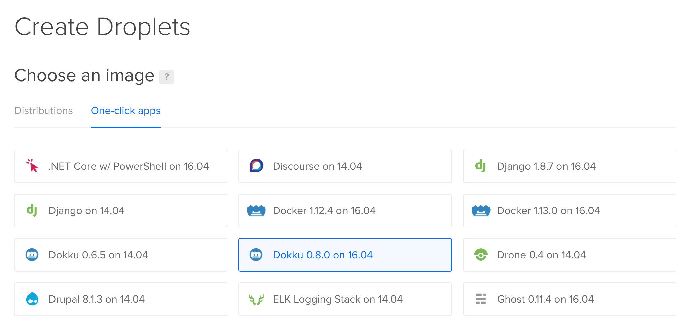

In this post I'll give a step by step tutorial on how to set up and deploy your first simple site with [Node.js](http://nodejs.org), using the [Express](http://expressjs.com) framework, deployed to [Digital Ocean](http://digitalocean.com) using [Dokku](http://dokku.viewdocs.io).

### Dokku

[Dokku](http://dokku.viewdocs.io) is docker powered _"mini-Heroku"_. Dokku provides a better interface to app deployment, comparable to the offerings of Heroku. It works for any VPC, but I favor DigitalOcean for quick setup and ease of use.

### Digital Ocean

[DigitalOcean](http://digitalocean.com) is a great place to host your web apps, being cheaper than other, managed services or [Heroku](http://heroku.com). It has a $5/month plan, and using the DigitalOcean promo code gives you $10 credit (two months) for free to try it out.

## Sign up

Use this [link](https://m.do.co/c/97a3ba42afda) to Sign up for DigitalOcean. You'll get 10$ for free out that. Down side is that you have to add a credit card (I'd' love to not have to do this, but they don’t charge you until you run out of credit.) or pay 5$ credit via PayPal.

## Get Domain (Optional)

Get your self a domain that makes all things cleaner.

## Setup SSH Key

If you don't have SSH Key generate it otherwise just skip the following step.

```bash
ssh-keygen -t rsa -b 4096 -C "your_email@example.com"
```

Now copy your SSH Key to clipboard

```bash
pbcopy < ~/.ssh/id_rsa.pub
```

Navigate to `Click on profile picture > Settings > Add SHH Key` and paste you link.

## Create Digital Ocean Droplet

If you have a real domain available use that as your hostname.
Select the dokku app from the list of applications.



Add your SSH key and create the droplet.

**You need to DELETE the droplet to stop being charged for it. You will still be charged the hourly rate even if you power it down.**

## Setup DNS

At your domain registrator create _A record_ pointing to your location. Eg. setting in OnLine DNS:

```
Name      Adress                TTL
––––––––––––––––––––––––––––––––––––––––––––—–——————
@         droplet_ip_address    900
*         droplet_ip_address    900
```

## Set up Dokku Droplet

Navigate to domain you've setup in the previous step

_Note: If did setup DNS record recently it may take some time to propagate changes._


Check option "Use virtualhost naming for apps". It will allow you to access apps in the following manner.

```
http://myapp.your-domain.com
```

Click "Finish Setup".

Now `ssh` into your machine and execute following steps before your deploy apps to settup proper server locale.

```bash
echo 'LANG=en_US.UTF-8' > /etc/default/locale
echo 'LC_ALL=en_US.UTF-8' >> /etc/default/locale
sudo locale-gen en_US en_US.UTF-8
reboot
```

## Creating application

Now create [express](http://expressjs.com) application using [generator](http://expressjs.com/en/starter/generator.html).

```bash
express --view=pug myapp
```

Navigate to project directory

```bash
cd myapp
```

Create Procfile to launch application.

```bash
echo "web: node ./bin/www" > Procfile
```

Now, our application is created and we can deploy to the Dokku server.

## Deploying to Dokku

Deploying to Dokku is really simple. We just need to `git push` to a particular remote. In your terminal, type:

Next, create a new file called .gitignore and add:

```
node_modules
```

This makes sure we don't copy those with our code unnecessarily, as Dokku will install any dependencies that are needed. Now, back in your terminal, type the following commands:

```bash
git init && git add --all && git commit -m "Initial commit"
```

First, first command makes project a Git repository. Following commands adds all changes.

```bash
git remote add dokku dokku@your-domain.com:myapp
```

Next we add a remote called dokku at the location `dokku@your-domain.com:myapp`. The `:myapp` is the name of our app. Remember when I mentioned multiple apps on the same server, that's where the app name is important.

Now, to deploy, we simply push our code to the Dokku server:

```bash
git push dokku master
```

Wait a minute or so, read the output:

```
...
-----> Releasing myapp ...

-----> Deploying myapp ...
-----> Cleaning up ...
=====> Application deployed:
       http://myapp.your-domain.com

To dokku@your-domain.com:myapp
```

Then we can hit our URL and get our site!

Please feel free to comment and share!
